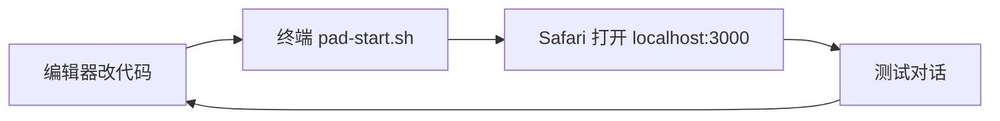

# Pad 本机开发与测试指南

## 为什么不能再「只点开一个 HTML」？

当前项目把页面拆成多个文件，并增加了 **Node 服务**（`server.js`），原因：

1. **API 密钥**放在 `.env`，由服务端转发，不会暴露在网页源码里（单 HTML 往往只能把密钥写在页面里，容易泄露）。
2. 浏览器对 **`file://` 打开的文件**限制很严：ES 模块、`fetch` 请求 `/api/chat` 都会失败。
3. 因此流程变成：**终端启动服务 → Safari 访问 `http://localhost:3000`**。对你来说仍然只是「打开一个地址」，只是不能从「文件」App 直接点 HTML。

---

## 推荐工作流（Pad 当开发机）



### 准备环境（一次性）

#### iPad + iSH

1. 安装 [iSH](https://ish.app/)，打开后执行：

```sh
apk update
apk add nodejs npm git
```

2. 把项目 clone 或拷贝到 iSH 家目录，例如 `~/Points-of-mess`。
3. `cd ~/Points-of-mess`，按下面「启动」操作。

> iSH 里 `localhost` 即本机，Safari 输入 `http://127.0.0.1:3000` 即可。

#### Android 平板 + Termux

```sh
pkg install nodejs git
cd ~/storage/shared/Points-of-mess   # 按你的实际路径
sh pad-start.sh
```

浏览器打开 `http://127.0.0.1:3000`。

### 启动项目

```bash
cd /path/to/Points-of-mess
sh pad-start.sh
```

等价于：

```bash
npm install    # 首次
npm start      # 之后可直接 npm start
```

### 开发时自动重启（可选）

```bash
npm run dev
```

保存 `js/*.js`、`index.html` 等后，服务会自动重启，Safari **刷新**即可。

---

## 项目文件是干什么的？（不用全懂）

```
index.html       ← 浏览器入口（你只访问网址，不直接点这个文件）
styles/chat.css  ← 外观
js/app.js        ← 按钮、发送、流式显示
js/api.js        ← 调用 /api/chat
js/state.js      ← 本地保存聊天记录
js/render.js     ← 消息气泡渲染
server.js        ← 启动后才有对话能力（代理 DeepSeek）
.env             ← 你的 API 密钥（勿分享、勿提交 Git）
package.json     ← 依赖列表，给 npm 用
```

**你日常只需要：** 编辑器 + 终端 + Safari 一个书签。

---

## 从「单 HTML」迁移的心智模型

| 以前 | 现在 |
|------|------|
| 改一个 html，双击打开 | 改多个文件，**终端 `npm start` 一次** |
| 刷新 = 重新打开文件 | 刷新 = Safari 刷新 `http://localhost:3000` |
| 密钥在 html 里 | 密钥在 `.env`，更安全 |

如果暂时只想改界面：只动 `index.html` 和 `styles/chat.css`，启动方式不变。

---

## 常见问题

### Q：在「文件」里打开 `index.html` 是空白或没反应？

**A：** 必须用 `http://localhost:3000`，不要用文件 App 直接打开。

### Q：Pad 上没有 npm / node？

**A：** 需要 iSH、Termux 等带 Linux 环境的终端；纯「文件 + Safari」无法跑当前架构。可选方案：在电脑上 `npm start`，Pad 浏览器访问电脑的局域网 IP（见 README「在 Pad / 平板上使用」）。

### Q：终端显示「未配置 DEEPSEEK_API_KEY」？

**A：** 复制 `.env.example` 为 `.env`，填入密钥后重新 `sh pad-start.sh`。

### Q：文件太多，编辑器的 App 推荐？

**A：** Working Copy（Git）、Textastic、a-Shell（带编辑）、Code App 等，**打开整个项目文件夹**，不要只复制单个 html。

---

## 安全提醒

- 不要把 `DEEPSEEK_API_KEY` 写进 `index.html` 或任何 `js/*.js`。
- 不要把 `.env` 发到聊天或截图里。
