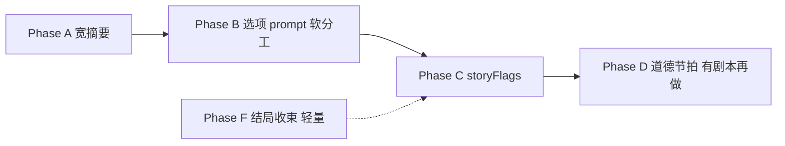

# 计划：叙事与选项 — 下一阶段（Plan 模式）

> 对照外部评测与 v0.4.3 现状。与 [PLAN-api-reliability.md](./PLAN-api-reliability.md)（技术稳态）并列。  
> **§8 为 2026-05 讨论拍板**，实现以本文 + `js/version.js` 为准。

---

## 0. 现状快照（v0.4.3）

| 已有 | 说明 |
|------|------|
| 拆分 API | ① 纯文本 reply → ② AI 生成 keypoint/followup |
| 固定收束 | 第 3 钮恒为 `行。我就当成你没参与。` |
| 无换题 | 已按产品决定删除 pivot |
| 摘要 | 每 4 轮选项后压缩，**≤80 字**（待 Phase A 放宽） |
| 地图桌面 | **PLAN·叙事** → 本文 |
| 选项重复检测 | 代码里仍有「与上一轮相同则重生成」——**拍板后应移除** |

---

## 1. 外部建议 ↔ 我们的判断（更新）

| 建议 | 状态 |
|------|------|
| 摘要递进 + 保留专名 | **P0，尽量拉满字数**（见 §8.1） |
| 优化选项 prompt（求证/质问） | **可做**（Phase B），不强制去相似 |
| 相似选项过滤 / 重生成 | **不做**——AI 认为玩家会问就允许 |
| 分支语气（flags） | **中期**（Phase C） |
| 场景移动 / 行动换图 | **暂缓**，不在近期路线 |
| 道德节拍 | 有内容后再做（Phase D） |
| 网状叙事 / 多结局 | **轻量骨架先行**（§9），不写具体剧本 |

---

## 2. 产品目标（拍板后）

| 优先级 | 目标 | 非目标 |
|--------|------|--------|
| P0 | **摘要尽可能宽**，结构化递进，禁止删旧事实 | 80 字硬 cap |
| P1 | ①② prompt 可区分求证/质问（软引导） | 选项相似度检测、强制重生成 |
| P2 | 轻量 `storyState` + 结局轨道占位 | 完整网状剧本、大地图 |
| P3 | flags 调 reply 语气 | 每轮平行宇宙 |
| — | — | 场景切换（Phase E 冻结） |

---

## 3. 方案分阶段（修订路线）



**冻结**：原 Phase E（行动/换场景）——不排期。

---

### Phase A — 宽摘要记忆（v0.5，**下一版实现**）

**原则**：摘要是最重要的长期记忆，**在 API 允许范围内尽量写满**，宁可长也不要删专名。

**技术上限（建议实现值）**：

| 项 | 现值 | 目标 |
|----|------|------|
| `PomTokens.SUMMARY` | 512 | **2048**（输出 token 上限） |
| prompt 字数要求 | ≤80 字 | **≤1200 字**（约 1500～1800 汉字量级内由模型自洽；禁止人为压到几百字） |
| 压缩频率 | 每 4 轮选项 | **暂保持 4 轮**（先靠「宽」解决失忆；过频再改为 6） |

**`SUMMARY_SYSTEM` 要点**：

1. **递进合并**：输入「已有摘要 + 新增对白」→ 在旧摘要上**追加/更新**，禁止重写变短。
2. **固定结构**（便于人与模型扫读）：
   ```
   【已确认事实】…（人名、地点、物证、时间线，只增不删）
   【未解问题】…（玩家仍不知道的问句）
   【关系与态度】…（锋利/林晨/玩家之间的张力，可选）
   【本轮新增】…（本段压缩窗口内新信息）
   ```
3. **硬规则**：不得删除【已确认事实】里已出现的专名（林晨、化工厂、蓝色账本、定时装置等）；若冲突以「已确认」为准并加「待核实」。
4. **用尽篇幅**：在不超过 1200 字的前提下尽量写全；无新信息时【本轮新增】可写「无」。

**注入**：`requestReplyOnly` / 选项 prompt 已读 `plotSummary`；摘要变宽后无需改 HISTORY 轮数即可显著减失忆。

**验收**：连续 12+ 轮后，调试里的「剧情摘要」仍含至少 3 个核心专名；锋利不重复追问摘要里已写明的事实。

---

### Phase B — 选项 prompt（v0.5～0.6，与 A 可同版）

- 软分工：`keypoint` 偏求证、`followup` 偏质问（见旧版 Phase B 文案）。
- **不做**：相似度检测、禁止重复上一轮、因重复触发的重生成；可保留「禁止两条 line 完全相同」的 JSON 合法性校验（若 AI 返回两个一字不差，程序可任取其一或让 AI 重试一次 JSON，**不是因为像上一轮**）。

---

### Phase C — 轻量分支感（v0.6）

- `session.storyFlags`：`trustSharp`（-2～+2）、`pressedLin` 等。
- 只影响 reply 语气与摘要【关系与态度】段，**不**改变按钮数量。

---

### Phase D — 道德节拍（有剧本再做）

- 需用户提供 1 个节点描述后再实现。

---

### Phase F — 结局与网状叙事（轻量，见 §9）

- 与 Phase C 共用 `storyState`；无剧本也可先落数据结构。

---

## 4. 不建议做的（现阶段）

- 选项「与上一轮太像」的过滤或重生成
- 场景切换、化工厂子地图（已冻结）
- 恢复泛化换题钮
- 四轮全 AI 选项
- 无结局文案就做长篇多结局演出

---

## 5. 协作顺序

**下一刀**：只实现 **Phase A**（宽摘要 + 去掉选项重复重生成逻辑）→ v0.5.0。  
Phase B 可与 A 同 PR；Phase F 骨架可与 A 同 PR 或紧随其后（仅 `state.js` 字段，无 UI）。

---

## 6. 文档索引

| 文档 | 用途 |
|------|------|
| PLAN-api-reliability.md | API / 稳定性 |
| PLAN-map-desktop.md | 地图读文档 |
| **PLAN-narrative-next.md（本文）** | 叙事与玩法 |

---

## 7. 原待拍板问题（已关闭）

| 问题 | 结论 |
|------|------|
| 摘要上限 | **尽可能宽**（§8.1 / Phase A） |
| 选项相似 | **不检查** |
| 场景移动 | **不做**（近期） |
| 多结局 | **轻量骨架**（§9），具体内容后填 |

---

## 8. 讨论拍板（2026-05）

### 8.1 摘要尽可能拉满

- 产品：**摘要优先级高于省 token**。
- 实现：提高 `max_tokens` + prompt 要求「结构化 + 递进 + 用尽允许篇幅」；**不再**在 prompt 里写「不超过 80 字」。
- 成本：每 4 轮多一次摘要调用，单次输出变长；相对整局仍可控。
- 风险：摘要过长挤占 reply 的「注意力」——用分段标题缓解；若实测 reply 变散，再在 system 里加「reply 只回应最近一轮，事实以摘要为准」。

### 8.2 选项相似无所谓

- 玩家若连续两轮选类似问法，视为合理扮演。
- 实现侧：**删除** `optionsDuplicateWithPrev` 触发的重生成与「禁止与上一轮相同」的 avoid 列表（保留 JSON 解析失败时的技术重试即可）。

### 8.3 场景移动

- 原 Phase E **冻结**，不在 v0.5～0.7 范围讨论。

---

## 9. 网状叙事 / 多结局 — 轻量框架（无剧本版）

> 目标：现在没有结局文案，也先把**数据结构**和**叙事语法**定好，避免以后大改存档格式。

### 9.1 概念区分

| 概念 | 含义 | 现阶段 |
|------|------|--------|
| **主线脊柱** | 锋利对峙、林晨线等默认推进 | 仍由 AI + 宽摘要驱动 |
| **软分支** | 同事实、不同语气/态度 | Phase C flags |
| **结局轨道 `endingTrack`** | 收束时的标签（非立刻多周目） | 先 `null`，节拍/收束时再赋值 |
| **网状** | 少数节点（2～4 个）可选倾向，汇聚到 2～3 条结局标签 | 不画全图，只记「走过哪些边」 |

不做：开放世界节点图、每个选项不同主线情报量。

### 9.2 建议的 `session.storyState`（实现时落 `state.js`）

```js
{
  phase: "default",           // 剧情阶段 id，preset 可定义
  endingTrack: null,          // null | "truth" | "complicit" | "walk_away" 等，后填枚举
  flags: {                    // Phase C
    trustSharp: 0,
    pressedLin: false,
  },
  beatsSeen: [],              // 已触发的节拍 id，防重复
  endingGoals: [              // 可选：无剧本时的抽象目标，供摘要/reply 引用
    { id: "truth", label: "弄清内鬼与账本下落" },
    { id: "survive", label: "在对峙中保住自己" },
  ],
}
```

- **`endingGoals`**：不是 UI，只在 system/摘要里一句「本局倾向目标：…」；你之后写剧本可替换 preset 里的数组。
- **`endingTrack`**：仅在（1）玩家选过道德节拍、或（2）连续选固定收束 N 次、或（3）手动 `phase=finale` 时写入；用于最后一轮 reply 或静态 epilogue 模板（未来）。
- **`beatsSeen`**：为网状留边；现在可空数组。

### 9.3 要不要现在设「结局目标」？

**要，但只设抽象层，不写结局正文。**

建议在 **preset / archetype** 里增加可选字段（无内容也能跑）：

```json
"endingGoals": [
  { "id": "truth", "label": "弄清真相" },
  { "id": "survive", "label": "全身而退" }
],
"possibleEndings": [
  { "id": "truth", "track": "truth", "hint": "（结局文案待写）" },
  { "id": "walk_away", "track": "walk_away", "hint": "（结局文案待写）" }
]
```

- 运行时：**不**强制走向某一结局；`endingTrack` 仅在收束逻辑触发时设置。
- 宽摘要的【未解问题】可含「本局更接近哪条结局目标」——由 AI 根据 flags 轻写，不硬编码分支树。

### 9.4 与多结局的关系

- **轻量多结局** = 2～3 个 `endingTrack` 标签 + 各一段 epilogue（以后写）。
- **网状** = `beatsSeen` + flags 记录「走过路径」，收束时选最近合轨的 `possibleEndings` 之一；**不要求**每条路径全程不同对白。
- 你现在没提供林晨/锋利结局正文 → **只落字段与 Plan**，v0.5 可不生成 epilogue UI。

### 9.5 实现顺序建议

1. v0.5：Phase A 宽摘要 + 去掉选项重复重生成  
2. v0.5.1 或 v0.6：`storyState` 默认值 + preset 可选 `endingGoals` / `possibleEndings`（空数组兼容）  
3. 有剧本后：Phase D 节拍写入 `beatsSeen` 并 bump `endingTrack`；Phase F 显示 1 屏结局摘要  

---

## 10. 仍待你后续提供（非阻塞）

- 道德节拍 1 句话（Phase D）
- `possibleEndings` 各轨 2～4 句 epilogue 文案（Phase F）
- 是否要把 `endingGoals` 默认写进「锋利」preset（可先写上面两条抽象目标）

---

*状态：讨论稿已拍板 §8～§9；Phase A 待开发 → v0.5.0。*
