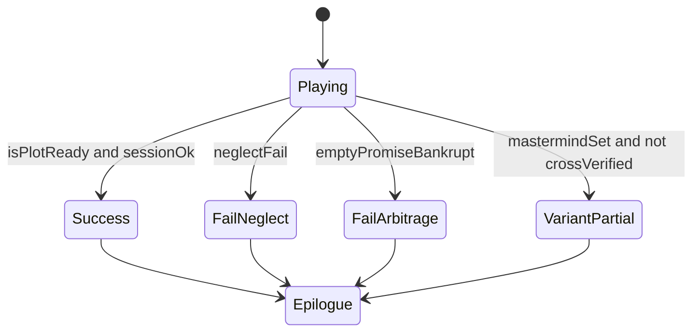

# Phase 2 路线图（v0.5.41 基线之后）

> **基线结论（2026-05）**：对峙单局的 **稳定性、事实一致性、防套利** 已达可用水平。  
> **产品重心**：对话中逐条获取**证据**、逐条闭合**论断**，直至**论证目标**成立。  
> **「三推一」= 论证骨架俗称，非固定条数**；preset 可配 **2 推 1 / 3 推 2** 等，见 **`docs/ROADMAP-argument-engine.md`**（优先级实施计划以该文档为准）。

你提供的 v0.5.41 日志说明：交换与结局能跑通，但出现 **指使者改口（刘老三→赵爷）两条并存**、`[待核实#1] 无`、敷衍句误拒。先做 **论证闭合 + 槽位卫生（阶段 A）**，再做多结局与交叉论证。

---

## 0. 当前架构（冻结，不推翻）

```
玩家选 intent → ① reply（交换契约）
              → ② options（亮牌/旁询）
              → ③ 摘要（档案）
              → reconcile（程序校正）
              → 结局判定（本轮末）
```

保留：**论证目标 + 前提证据 + 开放论断（条数由 preset 定）**、**只答不问**、**keypoint 举证交换**、**最少举证回合 + 对局内供述**。

---

## 1. Phase 2.0 — 摘要卫生：过期 / 矛盾事实

### 1.1 问题（来自 v0.5.41 日志）

| 现象 | 应变成 |
|------|--------|
| `锋利供述：指使者是刘老三` 与 `赵爷是主使` 并存 | **只保留最新主使供述**，旧条标 `[已推翻]` 或删除 |
| `[待核实#1] 无` | 无效行，reconcile **整行删除** |
| 种子行「可作筹码」长期占位 | 对局后期 **降权或折叠** 进【前提】段，不占 8 条配额 |
| 「你爱信不信」被拒 | 短促拒绝句 **白名单**，仍禁问号 |

### 1.2 数据模型（建议）

在【剧情档案】内增加可选行标记（摘要模型 + 程序均可写）：

```text
- [已确认] …
- [已推翻] …（被新供述替代，不参与结局判定）
- [待核实#1] …（仍至多 1 条，Phase 2.2 再扩展）
```

**槽位（slot）**：程序为每类事实设主键，避免同槽多条真值：

| slot | 含义 | 规则 |
|------|------|------|
| `mastermind` | 最终指使者 | 新 `锋利供述` 含指使/主使 → **覆盖** 旧 mastermind 行 |
| `ledger_holder` | 账本现持有人 | 覆盖 |
| `blocker` | 阻拦者 | 通常不变；玩家亮牌可固化 |
| `attitude` | 关系 | 仍放【关系与态度】，≤2 条 |

实现路径：

1. **轻量（2.0）**：`reconcilePlotSummary` 内正则 + 专名抽取，冲突时 **删旧留新**（按对话顺序或「锋利供述」时间戳序）。
2. **中量（2.1）**：摘要 prompt 要求写 `slot:` 前缀（如 `[已确认·mastermind]`），程序按 slot 合并。
3. **重量（2.3）**：结构化 JSON 档案再渲染为文本摘录（仅当 2.1 仍不够时）。

### 1.3 与 exchange 的衔接

- ① reply 前注入：`【档案矛盾】指使者已有赵爷，勿再报刘老三除非 [已推翻] 旧说。`
- 若模型仍改口：reconcile **以最后一轮 assistant 台词为准** 覆盖 slot。

### 1.4 验收

- 脚本：`verify-archive-contradiction.js`（刘老三→赵爷 只留赵爷）
- 人工：改口后 **结局仅认一个主使**；调试条 `reconcile · 覆盖 mastermind`

---

## 2. Phase 2.1 — 多结局分支

### 2.1 目标

同一套对峙，根据 **玩家路径** 得到不同收束：

| 结局 ID | 触发（示例） | 玩家体验 |
|---------|----------------|----------|
| `success` | 待证清空 + 双轨闭合 + 无未解决矛盾 | 现行「目标达成」 |
| `fail_neglect` | 回避 #1 达 `neglectPrimaryFailAt` | 已有失败线，保留 |
| `fail_contradict` | 玩家逼供过猛但从未亮牌 / 空头交换破产 | 锋利离场，档案不完整 |
| `variant_cover` | 主使明确但玩家接受「刘老三递刀」版（未交叉验证） | **坏结局 / 半真相** |
| `variant_truth` | 主使 + 账本 + 交叉验证（见 2.2） | 完整真相 |

### 2.2 状态机（程序主导，模型只宣布）



- `session.endingVariant` 在 **摘要后** 计算，写入 debug。
- `requestEndingReply` 的 system 带 `endingVariant` 与 `endingEpilogueTemplates[variant]`。
- **close 选项** 可按 variant 换文案（懊悔 / 得意 / 含糊离场）。

### 2.3 配置（presets）

```javascript
onionSeed: {
  endings: {
    success: { epilogueHint: "主使与账本线均已闭合…" },
    fail_neglect: { epilogueHint: "…" },
    variant_cover: { epilogueHint: "你接受了一半故事…" },
  },
  crossVerify: {
    requiredSlots: ["mastermind", "ledger_holder"],
    contradictIf: ["刘老三", "赵爷"], // 两名同时处于 [已确认] 且无 [已推翻]
  },
}
```

### 2.4 验收

- 故意只 followup 不亮牌 → `fail_neglect`
- 只信第一轮刘老三、不追问 → `variant_cover`
- 标准双 keypoint + 一致供述 → `success`

---

## 3. Phase 2.2 — 中层线索网（并行 + 交叉验证）

### 3.1 从「1 条待证」到「小图」

仍保持 **一个本局目标**，但【剧情档案】允许：

```text
- [待核实#A] 指使者是谁
- [待核实#B] 账本现下落
- [待核实#C] 陈四与账本是否同一指使链（交叉）]
```

约束（防爆炸）：

- 并行待核实 **≤3**，且必须 **标注依赖**（C 依赖 A∩B）。
- 结局 `success` 要求：**目标相关槽全闭合 + 交叉项 C 为真或假已确认**。

### 3.2 交叉验证（程序可判）

定义 **矛盾对**（seed 配置）：

```javascript
clueConflicts: [
  { a: "mastermind:刘老三", b: "mastermind:赵爷", resolve: "ask_sharp_twice" },
]
```

当档案同时存在未被推翻的 a、b：

- ② options 注入：**「赵爷与刘老三说法冲突，你认哪一个？」**
- keypoint 须引用 **锋利上一句** 或 **选边站队**，不能只换筹码。
- reconcile 后仅保留 **玩家选边** 或 **锋利最终供述**。

### 3.3 与 3 推 1 的关系

- **前提**：种子 3 条 `[已确认]` 仍为起点。
- **待证**：1 条为主问题（#A），#B/#C 由 **第一轮交换** 后程序追加（非模型随意加）。
- 摘要 prompt：**禁止** 新增超过 seed 允许的并行数。

### 3.4 验收

- 单局可玩：先闭合 A，再 B，最后 C
- 日志：`待核实` 计数 ≤3；`crossVerified: true` 才进 `success`

---

## 4. 推荐实施顺序

> **详细分阶段表见 `docs/ROADMAP-argument-engine.md` §5（阶段 A→D）。**

| 阶段 | 范围 | 风险 | 价值 |
|------|------|------|------|
| **A** | `maxOpenClaims`、槽位覆盖、`isArgumentClosed`、短拒白名单 | 低 | 论证可伸缩 + 坏档修复 |
| **B** | prompt 去固定三推一；2 推 1 / 3 推 2 preset | 低～中 | 自然节奏、局长短可选 |
| **C** | `endingVariant` + epilogue | 中 | 重玩价值 |
| **D** | 交叉论证、claim 依赖 | 高 | 深度推理（A 稳定后再做） |

**建议**：A 做完再 B；C 依赖 A 的闭合判定；D 最后。

---

## 5. 与「不要再改」的边界

以下内容 **Phase 2 不优先动**：

- 合并 ①②③ 为单次 API（成本优化，非体验瓶颈）
- 宇宙地图 / 多点 UI（PRODUCT 规划另册）
- 无限开放世界式摘要（仍按局收敛）

---

## 6. 你这一局若用 2.0  replay 会怎样

1. 第一轮 `刘老三是指使者` 写入 slot `mastermind`。  
2. 第三轮 `赵爷是主使` **覆盖** 刘老三行（或刘老三降为 `[已推翻]`）。  
3. `[待核实#1] 无` 被删，不误占版面。  
4. `endingVariant`：若玩家未用 keypoint 质疑矛盾 → `variant_cover`；若 keypoint 逼赵爷且账本闭合 → `success`。

---

*维护：与 `docs/DIALOGUE-PROMPT.md` 并列；实现状态以 `js/version.js` 为准。*
